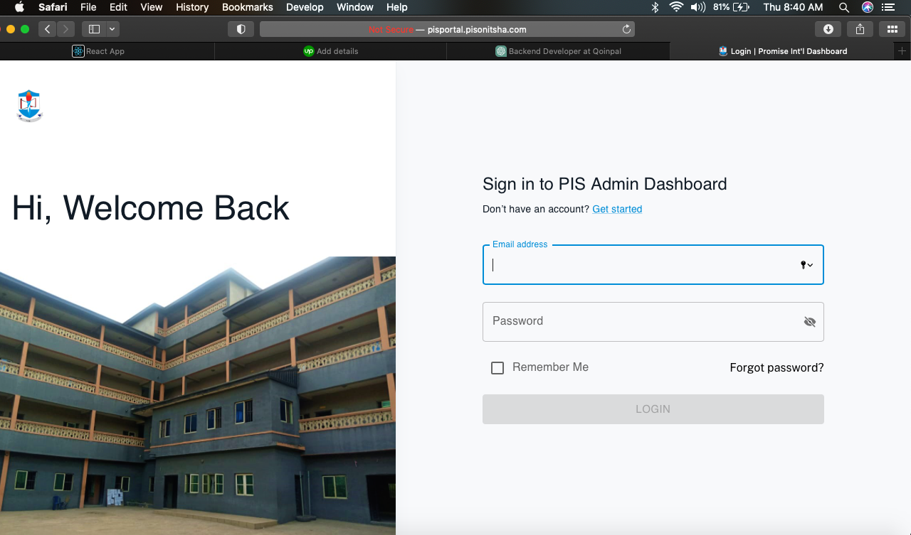
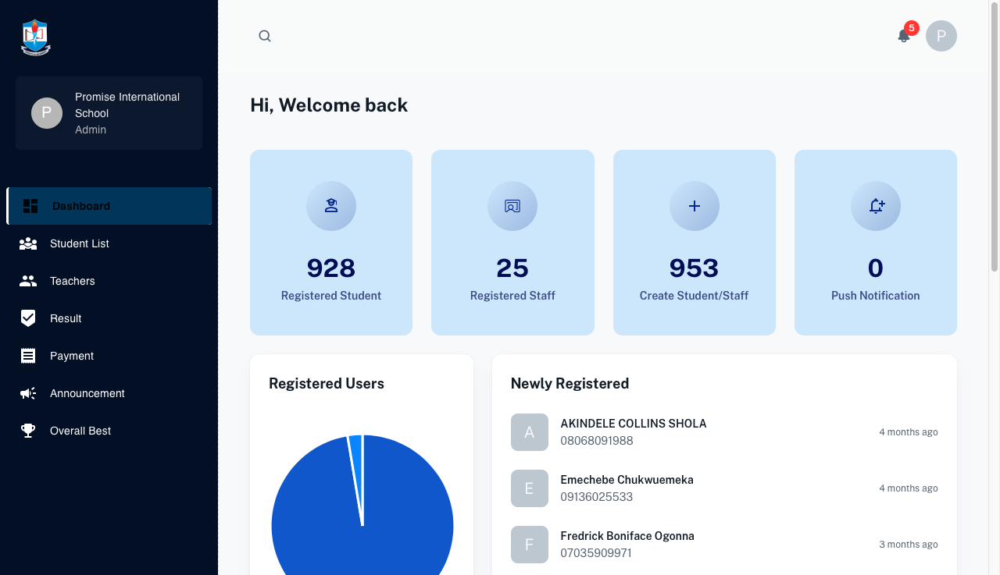
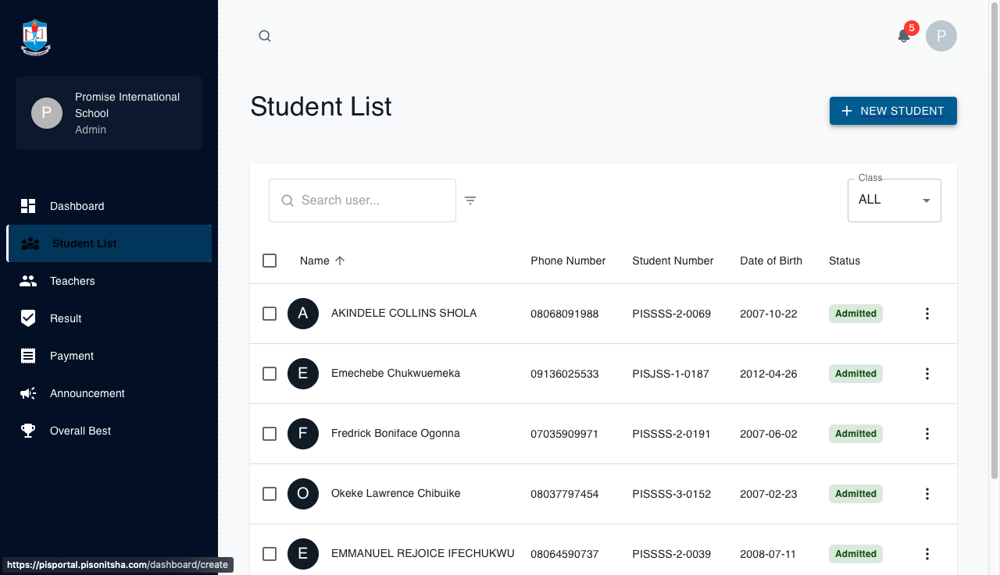

# School Admin Portal in Onitsha

This is the frontend part of a school admin portal located in Onitsha, Nigeria. The portal is designed to facilitate administrative tasks such as registering teachers and students, assigning courses to teachers, and managing student results.

## Features

- **Admin Dashboard**: Allows administrators to register teachers and students, and assign courses to teachers.
- **Teacher Dashboard**: Teachers can view their assigned subjects and register marks for students accordingly.
- **Students' Portal**: Students can access their results through the portal.

## Technology Stack

- **Frontend**: React.js
- **Backend**: Node.js
- **Database**: MySQL
- **Hosting**: True-host

## Usage

To run this project locally, follow these steps:

1. Ensure you have Node.js installed on your machine.
2. Clone this repository.
3. Navigate to the project directory.
4. Run `npm install` or `yarn install` to install dependencies.
5. Update the base URL in the frontend code to point to your own deployed backend.
6. Start the development server using `npm start` or `yarn start`.

## Note

This frontend interacts with a backend implemented in Node.js and MySQL database. Make sure you have the backend set up and running before using this frontend.

## Screenshots

